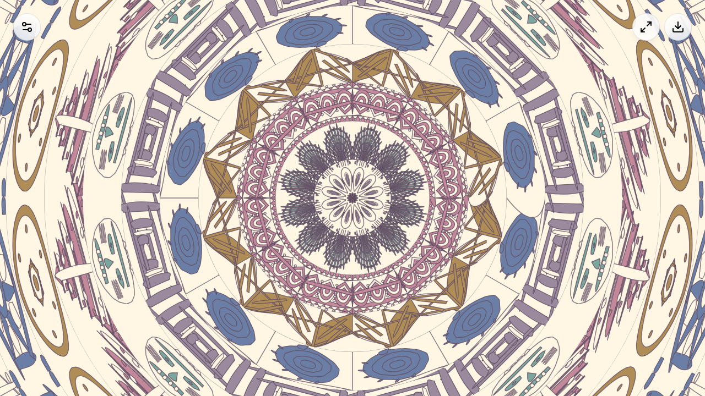

# Mandala Generator

**[Try it live](https://midislave.github.io/Mandala-ai/)**

An interactive mandala generator that renders culturally-inspired geometric patterns on HTML5 Canvas with a hand-drawn aesthetic. Explore infinite tunnel zoom, animated rotations, and 33 distinct pattern sets — plus a **Live Mode** that transforms real-time news headlines into visual mandala art using dense grids of sharp Lucide icons.



## Features

- **Infinite tunnel zoom** — pinch or scroll to travel endlessly inward/outward
- **33 pattern sets** across cultural, generative, art movement, research-inspired, figurative, and thematic categories, plus Mix mode
- **Mandala Live** — news headlines drive the visualization with dense adaptive icon grid motifs ([details](docs/live-mode.md))
- **Hand-drawn aesthetic** — per-pass roughness wobble and paper grain overlay
- **Touch and mouse gestures** — drag, pinch, double-tap, scroll
- **Auto-animation** — continuous spin, zoom, and wave bulge
- **Save to PNG** — export the canvas as a high-resolution image
- **Fullscreen mode** — immersive viewing (cross-browser including iPad Safari)

## Pattern Sets

33 pattern sets organized into six categories. See the **[Pattern Reference Gallery](docs/patterns.md)** for visual strips of every motif.

| Category | Sets | Examples |
|----------|------|----------|
| **Cultural** (17) | Aztec, Nordic, Lace, Chevron, Greek Key, Tribal, Lotus, Art Deco, Japanese, Sacred, Celtic, Egyptian, Mesoamerican, Islamic, Aboriginal, Polynesian, Embroidery | Stepped pyramids, knotwork, lotus blooms, seigaiha waves, girih stars |
| **Generative** (6) | Generative, Guilloche, Fractal, Spirals, Harmonograph, Truchet | Rose curves, Sierpinski, Fibonacci spirals, cymatics, moiré |
| **Art Movements** (2) | Op Art, Art Nouveau | Checkerboard spheres, whiplash curves, Tiffany glass |
| **Research** (4) | Maze, Flow Field, Noise Strata, Organic Cells | Theta mazes, flow fields, topographic strata, Voronoi |
| **Figurative** (2) | Icons, Animals | Lucide icon grids, cats, elephants, giraffes, bats, snakes |
| **Thematic** (2) | Death / Dark, Australasian Flora | Skulls, swords, explosions, banksia, waratah, silver fern |

## Mandala Live

Live Mode transforms the mandala into a real-time news visualization. Each ring displays **dense grid motif blocks** of sharp Lucide icons representing the story's keywords and theme — primary icons take 4–9 blocks, secondaries fill the remaining cells.

See **[Live Mode Documentation](docs/live-mode.md)** for setup and details.

**Works without API keys** — falls back to RSS feeds and keyword-based classification.

## Controls

| Input | Action |
|-------|--------|
| Drag (1 finger / mouse) | Twist and change symmetry |
| Pinch / scroll wheel | Infinite zoom in/out |
| Double-tap | Randomize pattern seed |
| Hover / touch | Expand nearby layers (reactive bulge) |

## Run Locally

```bash
npm install
npm run dev
```

Dev server starts at `http://localhost:3000`.

```bash
npm run build     # Production build
npm run lint      # Type-check (tsc --noEmit)
```

## CLI Tools

```bash
npx tsx tools/cli.ts render-strips    # Reference strips for all pattern sets
npx tsx tools/cli.ts render-all       # Full render pipeline
npx tsx tools/cli.ts analyze          # Analyze rendered tiles
npx tsx tools/cli.ts list             # List all pattern sets
```

## Tech Stack

React 19 · TypeScript 5.8 · Vite 6 · Tailwind CSS 4 · HTML5 Canvas 2D · Lucide React · Motion (Framer Motion)

## License

See repository for license details.
