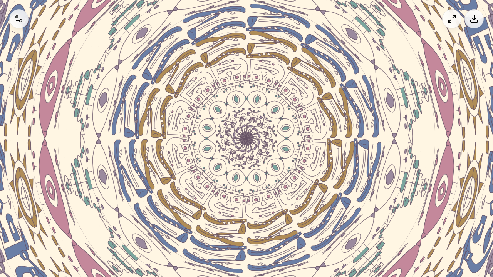

# Mandala Live

> **Viewer discretion advised.** Live mode visualizes real-time news headlines which may include content related to conflict, violence, crime, disasters, and other sensitive topics reflecting current global events. Headline imagery and icons are generated automatically from news feeds without editorial filtering.

Mandala Live transforms the generator into a real-time news visualization. Each mandala ring represents a headline — rendered with sharp Lucide icons in dense, adaptive grid motif blocks, or with tiled article photographs, completely isolated from the hand-drawn pattern system.



## How It Works

1. **News fetching** — headlines from CurrentsAPI (with key) or RSS feeds (Google News, BBC, Reuters)
2. **Classification** — Google Gemini classifies into 16 themes + sentiment, or falls back to keyword matching
3. **Icon motif blocks** — each ring displays a tiled grid of Lucide icons representing the headline's keywords and theme
4. **Adaptive grid** — thick bands use a 4×4 grid (primary icon 2×2–3×3, secondaries 1×1–2×2); thin bands scale down to 2×2 or single-row layouts
5. **Sentiment** — negative news increases roughness and spin; positive news is smoother and calmer

## Icon Grid Layout

Each ring is divided into repeating motif tiles. Within each tile, a 4×4 grid (16 blocks) is allocated:

- **Primary icon** (the headline's main theme icon) occupies **2×2 or 3×3 blocks** (4–9 cells)
- **Secondary icons** (keyword-matched) fill remaining cells at **1×1 to 2×2 sizes** (1–4 cells)
- Thin bands automatically scale to smaller grids so icons stay dense even when spawning

For example, *"Iran launches missile strike against Israel defense forces"* renders as a grid of swords, rocket, flag, and shield icons of varying sizes — the dominant theme icon (swords) appears largest.

## Icon System

Live mode uses **Lucide's 1,800+ icon library** rendered directly on canvas via Path2D — sharp and crisp, not hand-drawn.

A keyword index maps 500+ words to specific Lucide icons across 20+ categories:

| Category | Example keywords | Icons |
|----------|-----------------|-------|
| Conflict | war, missile, troops, bomb | swords, rocket, shield, bomb |
| Economy | market, inflation, bank, crypto | chart-line, trending-up, landmark, bitcoin |
| Weather | hurricane, flood, wildfire | tornado, waves, flame |
| Health | vaccine, hospital, virus | syringe, hospital, bug |
| Politics | election, congress, vote | vote, landmark, gavel |
| Technology | AI, cyber, chip, hack | brain-circuit, lock, cpu |
| Space | rocket, satellite, mars | rocket, satellite-dish, telescope |
| Transport | plane, ship, train, car | plane, ship, train, car |
| Crime | arrest, murder, police | skull, crosshair, siren, scan-face |
| Disaster | earthquake, tsunami, explosion | brick-wall-fire, waves, bomb, skull |
| ... | 10+ more categories | |

## 16 News Themes

`conflict` `economy` `weather` `health` `politics` `technology` `sports` `culture` `environment` `science` `crime` `disaster` `diplomacy` `education` `space` `general`

## Usage

1. Click **Live Mode** in the control panel
2. Toggle between **Icons** (Lucide icon grids) and **Photos** (article thumbnail images tiled around rings)
3. Pattern dropdown is disabled — rings are driven by news
4. Color themes remain selectable
5. Headlines appear in the panel with sentiment dots (green/red/gray)
6. Click **Refresh** to fetch new headlines (auto-refreshes every 10 minutes)
7. Optionally add API keys under **API Keys** for richer results

Photo mode tiles article images around each mandala ring with a subtle theme-color tint. If no article images are available (e.g. when using mock/fallback data), it gracefully falls back to icon mode.

## Works Without API Keys

Live mode works out of the box:

| Feature | With keys | Without keys |
|---------|-----------|-------------|
| **News source** | CurrentsAPI (more sources) | RSS feeds (Google News, BBC, Reuters) |
| **Classification** | Gemini LLM (nuanced) | Keyword matching (functional) |
| **Icon mapping** | Same | Same |

API keys are optional enhancements — the keyword-based pipeline handles the full visualization.

## Architecture

Live mode rendering is **completely isolated** from the hand-drawn pattern pipeline:

```
src/live/
  render.ts        # Isolated canvas renderer (icon grids + photo tiling, sharp, no wobble)
  lucide-canvas.ts # Lucide icon → Canvas2D Path2D conversion
  icon-loader.ts   # Async dynamic loader for Lucide icons (1,800+ available)
  icon-index.ts    # 500+ keyword → Lucide icon name mappings
  image-loader.ts  # Async CORS image loader with cache for Photo Live mode
  classify.ts      # Gemini LLM + keyword fallback classification
  news.ts          # CurrentsAPI + RSS feed fetching (extracts image URLs)
  themes.ts        # Theme → color/pattern mapping
  types.ts         # TypeScript interfaces
```
